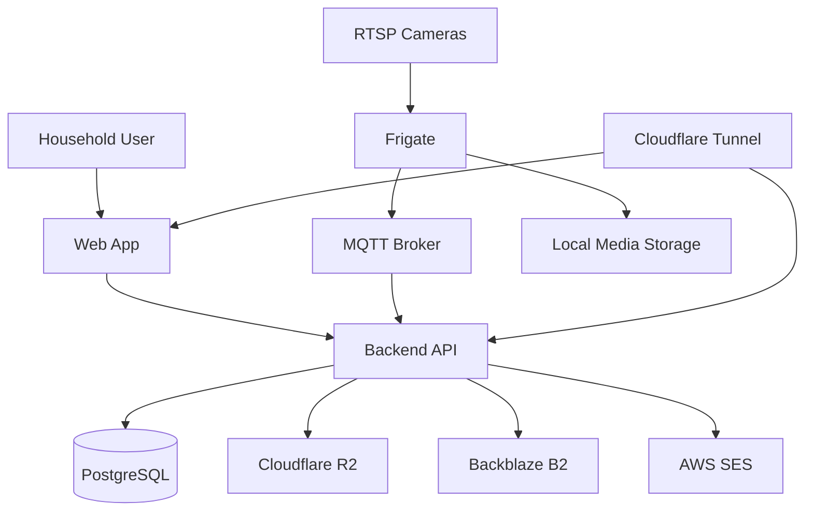
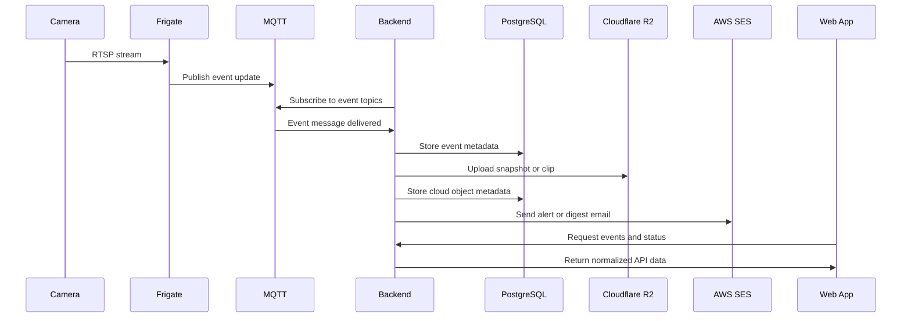

# Architecture

## Architectural Intent

The system is designed around a clear separation of concerns.

- `Frigate` handles camera stream ingestion, event detection, snapshots, and clips.
- `Mosquitto` carries Frigate-generated event messages.
- The custom `backend` persists metadata, runs jobs, coordinates storage uploads, and sends notifications.
- The `frontend` consumes the backend API and presents operational views.
- `Cloudflare R2` and `Backblaze B2` act as backup storage layers.
- `AWS SES` is used only for email delivery.

This keeps the custom code focused on orchestration and product behavior rather than reimplementing NVR capabilities.

## System Context

## Main Runtime Components

## Cameras

The cameras are expected to expose `RTSP` streams. They are intentionally treated as interchangeable inputs as long as they are standards-compliant and stable.

Important design assumption:

- the project should not depend on brand-specific cloud APIs

## Frigate

Frigate is the core video/event engine.

It is responsible for:

- connecting to RTSP streams
- creating motion and detection events
- generating or exposing snapshots and clips
- publishing event messages through MQTT
- maintaining local video-related state

The custom backend should treat Frigate as the event source of truth. That avoids duplicate detection logic and keeps the system understandable.

## MQTT Broker

MQTT acts as the event transport layer between Frigate and the backend. This is an effective fit because it keeps event ingestion loosely coupled and allows the backend to subscribe, reconnect, and process updates without requiring polling.

## Backend

The backend is the orchestration layer.

It should be responsible for:

- ingesting event messages from MQTT
- storing cameras, events, media metadata, and health information
- exposing a web API for the frontend
- handling authentication
- running scheduled jobs
- uploading media to object storage
- dispatching notification messages
- detecting and recording operational failures

## Frontend

The frontend is the operator-facing layer.

It should provide:

- dashboard view
- event review view
- clip review view
- camera inventory and status view
- settings and notification configuration view
- health and alert visibility

## Database

PostgreSQL stores durable operational state that Frigate alone does not model in the way this project needs.

Examples include:

- application users
- camera metadata
- normalized events
- cloud backup metadata
- notification logs
- health checks and status history

## Cloud Storage

Cloud storage exists for backup, portability, and recovery, not for primary live playback.

- `Cloudflare R2` is the primary object storage target.
- `Backblaze B2` is the fallback provider when primary uploads fail or when provider strategy changes later.

The backend should hide provider details behind a storage interface so that application code deals with media upload concepts rather than provider-specific API contracts.

## Email Delivery

Email is operationally separate from media storage.

- `AWS SES` sends alerts and digest emails.
- SES should not be treated as a storage or media distribution component.

## Event Flow

The most important architectural flow is the motion event lifecycle.

## Why This Event Flow Matters

This flow supports a clean operational model.

- Frigate focuses on detection and capture.
- The backend focuses on persistence and policy.
- The UI focuses on visibility and control.

That separation keeps debugging simpler when something goes wrong.

## Data Ownership Model

Each subsystem owns different kinds of truth.

- Frigate owns stream and event generation truth.
- The backend owns application workflow and operational policy truth.
- PostgreSQL owns durable application metadata truth.
- Object storage owns cloud backup copies of media artifacts.

This ownership model helps answer practical questions such as where to debug missing events, failed uploads, or notification errors.

## Failure Domains

The architecture should assume partial failures are normal.

Examples:

- a camera may go offline while the rest of the system remains healthy
- MQTT may be temporarily unavailable
- cloud uploads may fail while local storage still succeeds
- notification sends may fail independently of event persistence

The backend should therefore avoid tying these concerns together too tightly.

Recommended behavior:

- store event metadata first whenever possible
- perform cloud uploads asynchronously
- record upload and notification failures explicitly
- allow retries without duplicating core event records

## Trust Boundaries

The system crosses several trust boundaries.

- local camera network to Frigate
- Frigate event pipeline to backend
- local runtime to public cloud services
- authenticated user access to backend and media metadata

Security design should eventually reflect those boundaries, especially when remote access is introduced.

## Architectural Evolution

The design supports two stages.

## Stage 1

- software-first development
- mocked or partial event flows
- local-only access
- single-admin auth model

## Stage 2

- physical cameras and hub hardware
- tuned Frigate deployment
- remote access via Cloudflare Tunnel
- wider notification surface
- mature health and retention policies
