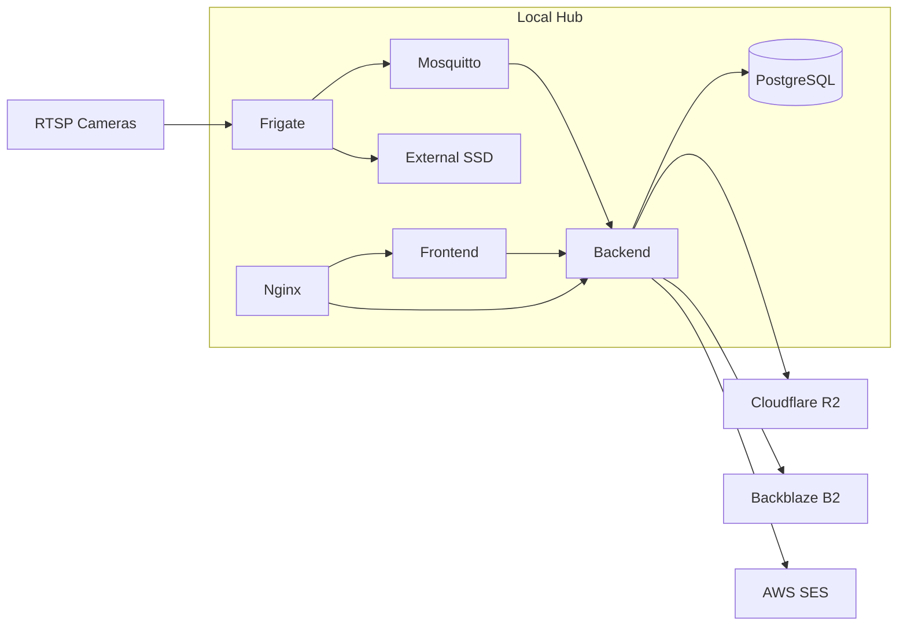

# Infrastructure Design

## Infrastructure Goal

The infrastructure should support a local-first monitoring system that remains understandable, portable, and easy to evolve from laptop development to Raspberry Pi deployment.

The current focus is the service topology and hosting model, not final production hardening.

## Runtime Topology

The project is designed around a small set of containerized services.

- `Frigate`
- `Mosquitto`
- `Backend`
- `PostgreSQL`
- `Frontend`
- `Nginx`

These services can be orchestrated through Docker Compose during development and on the eventual local hub.

## High-Level Deployment Shape

## Local Hub Assumptions

The eventual target hub is a Raspberry Pi 5 with external SSD storage. The Pi is responsible for running the application stack locally and storing primary media locally.

Important assumptions:

- local storage is primary
- cloud storage is backup
- motion-triggered recording is preferred over continuous recording
- the network should remain usable even when internet connectivity is degraded

## Container Roles

## Frigate

Owns video ingestion and event creation.

## Mosquitto

Acts as an internal message broker for Frigate event topics.

## Backend

Acts as the system integration and policy layer.

## PostgreSQL

Stores durable application data.

## Frontend

Hosts the web interface during development and may later be served as static assets behind Nginx.

## Nginx

Acts as reverse proxy and the public entry point for the local stack.

## Storage Strategy

The storage model has three layers.

- local media on the hub for primary storage and fast access
- Cloudflare R2 for primary cloud backup
- Backblaze B2 as fallback backup target

This layered approach allows the system to remain functional during cloud interruptions while still preserving off-device redundancy.

## Why R2 First And B2 Second

`Cloudflare R2` is a strong primary choice because it fits well with a modern object storage workflow and avoids some of the cost characteristics that make S3 less attractive for this type of project.

`Backblaze B2` is a reasonable fallback because it remains simple, established, and aligned with the same overall object-storage model.

The project should treat both through a common abstraction rather than letting provider specifics dictate application design.

## Email Infrastructure

`AWS SES` remains in the design specifically for email notifications.

That includes:

- alert emails
- daily digest emails
- weekly digest emails

It does not include:

- media storage
- clip delivery pipeline ownership
- application hosting

## Remote Access Strategy

Remote access is a later-stage concern, but the design already assumes it will be done through:

- `DuckDNS` for dynamic DNS if needed
- `Cloudflare Tunnel` for secure exposure without raw port forwarding

This is preferred over directly opening services to the public internet.

## Environment Shapes

The project effectively has three environments even if they are not formalized immediately.

## Local Development

- laptop or desktop development
- simulated inputs
- optional partial service stack

## Local Hub Deployment

- Raspberry Pi target runtime
- real Frigate and real MQTT
- attached SSD and real media retention

## Remote Access Usage

- same local hub runtime
- secure proxy exposure
- tighter auth and reverse proxy controls

## Infrastructure Principles

- keep services replaceable where possible
- avoid cloud dependence for core local functionality
- prefer clear service boundaries over hidden coupling
- keep cloud integrations asynchronous and resilient
- document storage and notification provider intent separately

## Near-Term Infrastructure Deliverables Without Hardware

1. improve Docker Compose so service intent is clearly represented
2. keep provider configuration isolated in environment variables
3. document expected volume mounts and data paths even before they exist physically
4. prepare Nginx and service boundaries before remote access is introduced
5. define storage and email integration contracts without requiring live credentials
