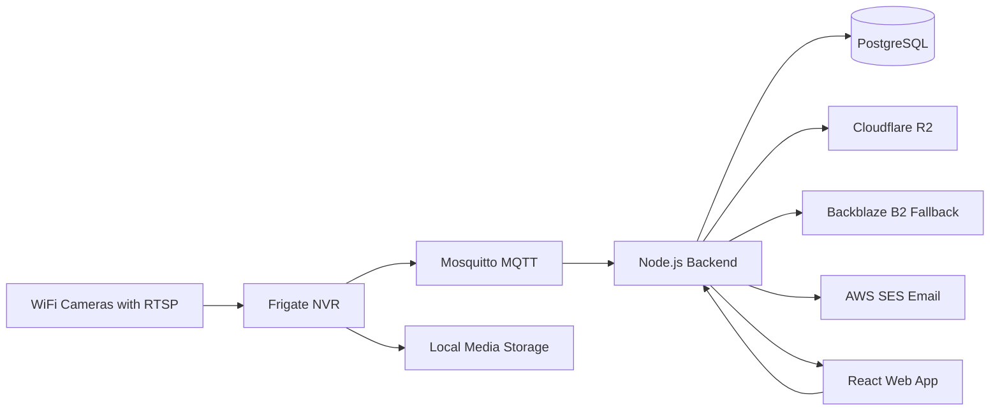

# Project Overview

## Purpose

This project is a self-hosted home monitoring platform centered on local ownership of video, event metadata, and operational control. The system is designed to ingest RTSP camera streams through Frigate, process motion-driven events, store metadata in PostgreSQL, expose a custom backend API, present a web interface for monitoring and review, and back up media to cloud object storage.

The current objective is not to complete physical deployment. The current objective is to design and implement the software core in a way that remains valid once Raspberry Pi hardware, cameras, and storage devices are purchased later.

## Why This Project Exists

Most consumer camera ecosystems are tied to vendor clouds, recurring fees, limited exportability, and opaque event pipelines. This project takes the opposite approach.

It is intended to provide:

- local-first control over streams and recordings
- portable infrastructure built from widely available components
- a custom web application focused on the exact monitoring and review workflows needed
- flexible cloud backup without locking the system into a single provider
- a clear upgrade path from software prototype to full physical deployment

## Core Goals

- Use open protocols such as `RTSP` and `MQTT`.
- Keep the local hub as the primary runtime and control plane.
- Use `Frigate` as the event source and NVR layer.
- Store operational metadata in a relational database.
- Build a dedicated web app rather than depending entirely on Frigate's UI.
- Use `Cloudflare R2` as the primary object storage target.
- Keep `Backblaze B2` available as fallback object storage.
- Use `AWS SES` for email notifications and digest reporting only.
- Support gradual rollout from one camera to many cameras.

## Non-Goals For The First Iteration

- Building a generic multi-tenant surveillance platform
- Implementing every notification channel immediately
- Solving advanced computer vision beyond what Frigate already provides
- Designing for broad third-party integrations from the start
- Over-optimizing for 8-10 cameras before validating the pipeline with smaller inputs

## Current Project Stage

The project is currently in the software foundation stage.

That means the immediate work is focused on:

- repository structure
- architectural documentation
- backend foundation
- frontend foundation
- database design
- storage abstraction design
- service topology definition
- simulation and mock-friendly development paths

It does not yet require:

- Raspberry Pi hardware
- production camera hardware
- production-grade Frigate tuning
- final network and reverse proxy hardening

## Design Principles

- Local-first. The hub should remain useful even if cloud backup is unavailable.
- Event-driven. Frigate produces the interesting events; the custom backend reacts to them.
- Minimal coupling. The backend should not depend on Frigate internals more than necessary.
- Replaceable cloud layer. Object storage should be abstracted so a provider change does not reshape the application.
- Software before hardware. Development should progress using simulated or partial inputs.
- Operational clarity. Health, failures, retries, and notification outcomes should be visible in the database and UI.
- Incremental rollout. The architecture should scale, but the implementation should begin with the smallest useful slice.

## System Summary

At a high level, the system has six main areas:

- cameras providing RTSP streams
- Frigate handling stream ingestion, eventing, clips, and snapshots
- MQTT carrying event messages
- backend services orchestrating persistence, storage sync, and notifications
- frontend application providing monitoring and review workflows
- cloud services supporting object storage backup and email delivery

## MVP Versus Target State

## MVP

The minimum useful version should prove the core operational loop:

1. Frigate receives at least one camera stream.
2. A motion event is published through MQTT.
3. The backend records the event and associated metadata.
4. The frontend shows the event and camera state.
5. Media is uploaded to Cloudflare R2.
6. Email alerts and digest messages can be sent through AWS SES.

## Target State

The longer-term target expands the same core design:

- 8-10 camera deployment
- hardware-backed local storage on external SSD
- reliable retention policies
- backup fallback to Backblaze B2
- remote access through Cloudflare Tunnel
- broader notification options such as WhatsApp and Viber
- stronger operational health checks and administration tools

## High-Level Context

## Why A Custom App Still Makes Sense

Frigate already provides valuable NVR and event capabilities, but the custom application exists for different reasons.

- It can expose project-specific dashboards and workflows.
- It can centralize notification history and system health information.
- It can present cloud backup status, retry status, and operational alerts that are outside Frigate's main focus.
- It can evolve independently as the household's needs become clearer.

## Recommended Near-Term Priorities

1. Finish documentation and keep it current as structure changes.
2. Scaffold backend architecture with clean module boundaries.
3. Scaffold frontend architecture with route structure and data contracts.
4. Add database schema direction and initial migrations.
5. Add a mock event ingestion path so core workflows can be built before hardware exists.
